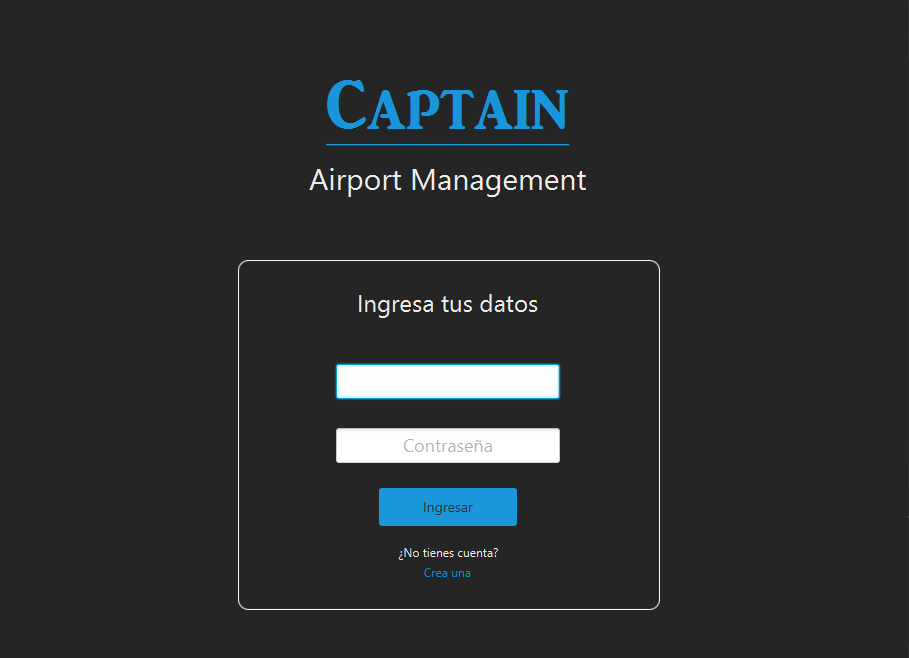
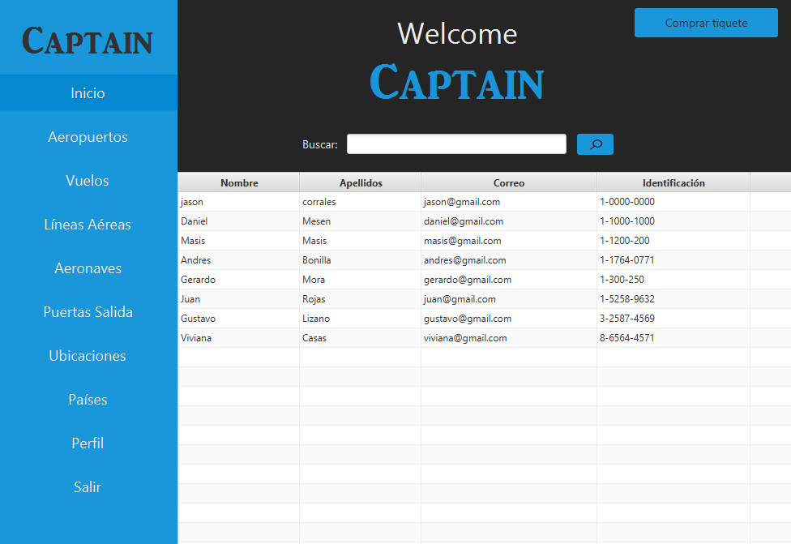

# Airports-Magement-System

Project that allows the control and management of the different services in an airport. 
  
This platform allows administrators to moderate all the information regarding the airport, gates, flights, and tickets. Also giving the opportunity to the final users to check all the flights schedules.
  
This project was created using Object Oriented Programming using Java version 8.
For the design the tool used was JavaFX and the data was stored in a local MySQL database.
 

<
